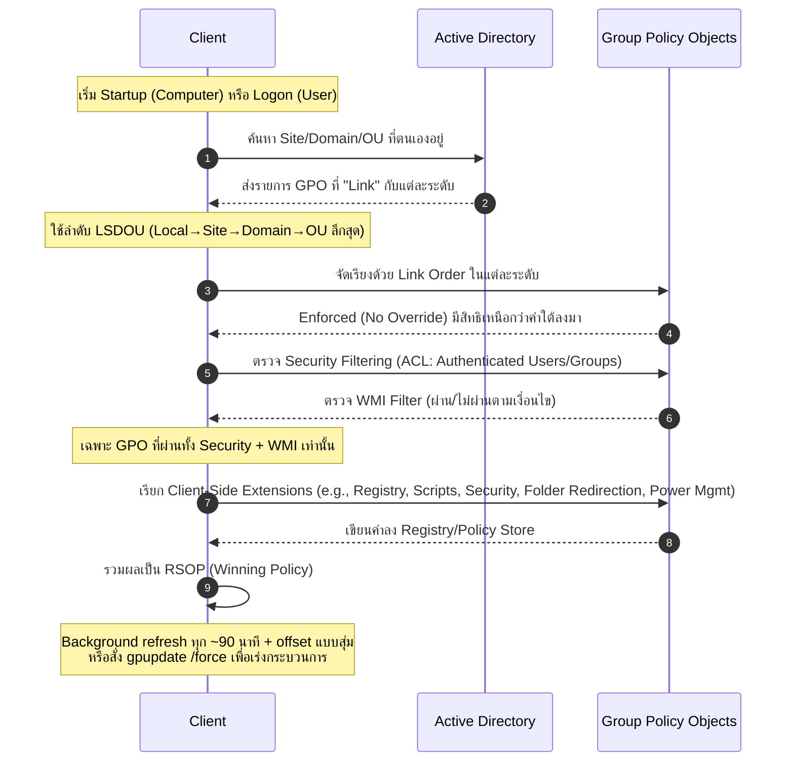

```mermaid
flowchart LR
    A[สร้าง GPO ใน GPMC] --> B["กำหนดค่าใน GPO (ADMX/Policies)"]
    B --> C[Link GPO ไปยัง Site / Domain / OU]
    C --> D{Inheritance?}
    D -->|Block Inheritance| E[หยุดรับจากระดับบน]
    D -->|ไม่บล็อก| F[รับ GPO จากระดับบนต่อไป]
    E --> G[กำหนด Link Order & Enforced]
    F --> G[กำหนด Link Order & Enforced]
    G --> H["Security Filtering (ACL)"]
    H --> I["WMI Filtering (เช็คเงื่อนไขเครื่อง)"]
    I --> J[Client ดึงนโยบายระหว่าง Startup/Logon หรือ Background Refresh]
    J --> K["Client-Side Extensions (CSE) ประมวลผลตามชนิดนโยบาย"]
    K --> L["(Registry/Policy Store)"] 
    L --> M["ผลลัพธ์สุดท้ายบนเครื่อง (RSOP)"]
```

# Troubleshooting: GPO Lock Screen 15 Minutes + Turn Off Display 5 Minutes (Windows 11)

## Problem Description

องค์กรได้ตั้งค่า **Group Policy (GPO)** สำหรับเครื่อง **Windows 11 Client** ตาม Security Baseline ของ Microsoft โดยกำหนด

- Lock Screen หลังจากไม่มีการใช้งาน **15 นาที**
- Turn off display หลังจาก lock จอ **5 นาที**

ดังนั้นพฤติกรรมที่คาดหวังคือ

| Event | Time |
|------|------|
| Lock Screen | 15 Minutes |
| Turn Off Display | 20 Minutes |

แต่พบว่าเครื่อง Client บางเครื่อง **ไม่ทำงานตาม GPO ที่กำหนด**

เช่น

- จอไม่ Lock
- Lock แต่ไม่ Turn off display
- ใช้เวลามากกว่าที่ตั้งไว้
- บางเครื่องไม่รับ Policy

โดยเครื่อง Client ใช้ **Microsoft Windows 11 Security Baseline**

---

# Expected Architecture

GPO ที่เกี่ยวข้องจะอยู่ในหลายตำแหน่ง เช่น

### Lock Screen Policy

```
Computer Configuration
 └ Administrative Templates
    └ System
       └ Power Management
```

และ

```
Computer Configuration
 └ Windows Settings
    └ Security Settings
       └ Local Policies
          └ Security Options
```

Policy หลักที่ใช้คือ

| Policy | Value |
|------|------|
| Interactive logon: Machine inactivity limit | 900 seconds |
| Turn off display (AC) | 20 minutes |
| Turn off display (DC) | 20 minutes |

---

# Possible Root Causes

## 1. Microsoft Security Baseline Override Policy

Microsoft Baseline อาจมี policy ที่ override ค่า power management เช่น

```
Windows Components
Power Management
```

หรือ

```
Device Lock
```

ทำให้ค่า GPO ที่ตั้งไว้ **ไม่ถูกใช้งาน**

---

## 2. Local Power Plan Override

เครื่อง Client อาจใช้ Power Plan ที่ override ค่า GPO เช่น

```
Balanced
High Performance
OEM Power Plan
```

ทำให้ค่า

```
Turn off display
Sleep timeout
```

ไม่ตรงกับ GPO

---

## 3. GPO Conflict

มีหลาย GPO ที่กำหนดค่าเดียวกัน เช่น

```
Baseline GPO
Security GPO
Desktop Policy
```

Policy ที่มี **precedence สูงกว่า** จะ override ค่า

---

## 4. Screen Saver Policy Not Configured

บางองค์กรตั้งเฉพาะ

```
Machine inactivity limit
```

แต่ **ไม่ได้ตั้ง Screen Saver Lock**

ซึ่งบางเครื่องจะไม่ lock ตาม expected behavior

---

# Recommended Configuration

เพื่อให้ lock screen ทำงานเสถียร ควรใช้ **2 Mechanisms**

## Method 1 (Recommended)

Machine inactivity limit

```
Computer Configuration
Security Settings
Local Policies
Security Options

Interactive logon: Machine inactivity limit = 900
```

---

## Method 2 (Backup Mechanism)

Screen Saver Lock

```
User Configuration
Administrative Templates
Control Panel
Personalization
```

| Policy | Value |
|------|------|
| Enable screen saver | Enabled |
| Password protect screen saver | Enabled |
| Screen saver timeout | 900 |

การตั้ง Screen Saver Lock จะช่วย **เป็น fallback mechanism**

---

# Client Troubleshooting Commands

## 1. Check Applied GPO

```
gpresult /r
```

หรือ

```
gpresult /h c:\temp\gpo.html
```

เปิดไฟล์

```
c:\temp\gpo.html
```

ดูว่า GPO ถูก apply หรือไม่

---

## 2. Check Power Configuration

ดูค่า power plan

```
powercfg /list
```

ดู timeout

```
powercfg /query
```

ดู display timeout

```
powercfg /query SCHEME_CURRENT SUB_VIDEO
```

---

## 3. Check Machine Inactivity Policy

ดู registry

```
reg query HKLM\Software\Microsoft\Windows\CurrentVersion\Policies\System
```

ดูค่า

```
InactivityTimeoutSecs
```

Expected value

```
900
```

---

## 4. Force GPO Update

```
gpupdate /force
```

---

## 5. Check Resultant Set of Policy (RSoP)

```
rsop.msc
```

ดูว่า policy ถูก override หรือไม่

---

# Recommended Troubleshooting Flow




---


# Recommended Troubleshooting Flow




---

# Best Practice Recommendation

เพื่อให้ระบบทำงานเสถียร แนะนำให้ตั้งค่า

### Required

```
Machine inactivity limit = 900
```

### Additional Protection

```
Enable screen saver = Enabled
Password protect screen saver = Enabled
Screen saver timeout = 900
```

### Power Policy

```
Turn off display = 5 minutes
```

---

# Summary

ปัญหา Lock Screen ไม่ทำงานใน Windows 11 ที่ใช้ Microsoft Baseline มักเกิดจาก

- Baseline policy override
- Power plan conflict
- ไม่มี Screen Saver Lock (แนะนำ)

แนวทางแก้ไขคือ

1. ตรวจสอบ GPO ด้วย `gpresult`
2. ตรวจสอบ power plan ด้วย `powercfg`
3. ตรวจสอบ registry policy
4. เพิ่ม Screen Saver Lock เป็น fallback mechanism

---

ปัญหาเพิ่มเติม 
# สรุปปัญหา & วิธีแก้ GPO: ห้าม User ปรับ Internet Options แต่ Admin ก็ถูกล็อก

##  ปัญหา?
สาเหตุเกิดจากคุณตั้งนโยบายใน **Computer Configuration** ซึ่งบังคับใช้กับ **ทุกบัญชีบนเครื่อง**  
ทำให้ไม่ว่าเป็น User หรือ Local Admin ก็ถูกล็อกเหมือนกัน  
เมื่อ Internet Options ถูกบังคับโดย Computer GPO ค่าในหน้าต่างจะถูก **greyed‑out** และ Admin ก็แก้ไม่ได้

---

## วิธีแก้ให้ถูกต้อง (เพื่อให้ล็อกเฉพาะ User เท่านั้น)

###  1) ย้าย Policy ไปใช้ **User Configuration**
ตั้งค่าในเส้นทางนี้:
User Configuration
→ Administrative Templates
→ Windows Components
→ Internet Explorer
→ Prevent changing proxy settings = Enabled

###  2) ลิงก์ GPO เฉพาะ OU ที่มี “User”
ไม่ต้องลิงก์กับ OU ของเครื่อง  
→ จะล็อกเฉพาะ User ตามที่ต้องการ  
→ Local Admin จะไม่ถูกนโยบายนี้บังคับ

 # 🔐  260326 สรุปสาเหตุ “จอมืด ~30–60 วินาทีหลัง Lock” และเหตุผลที่ดูเหมือน GPO ไม่ทำงาน

✅ อาการที่พบ

เครื่องถูกตั้ง Interactive logon / Screen saver / Turn off display ไว้เป็น 15–20 นาที
แต่เมื่อ Lock จอ (Win + L)
→ จอมืดภายใน ~30–60 วินาที
User งานเข้าใจว่า Windows ไม่เชื่อ GPO


ข้อสรุปสำคัญ

Windows ไม่ได้ไม่เชื่อ GPO
แต่หลังจาก Lock จอ Windows จะใช้ Power setting คนละตัว
ซึ่ง GPO ปกติไม่คุม


โครงสร้างการทำงานของ Windows 
Windows แยกออกเป็น 2 สถานะการทำงาน

1️⃣ สถานะ “ยังไม่ Lock”
ใช้ GPO ที่ผู้ดูแลระบบคุ้นเคย


✅ GPO เชื่อ 100%
✅ ค่าที่ตั้ง เช่น 15–20 นาที จะทำงานถูกต้อง

2️⃣ ✅ สถานะ “หลัง Lock จอ”
เมื่อกด Win + L หรือถูก lock อัตโนมัติ
Windows จะ ไม่ใช้ Policy ด้านบนอีกเลย
แต่จะสลับไปใช้ Power setting ใหม่ทันที คือ

🔴 Console lock display off timeout
(ชื่อภายใน: VIDEOCONLOCK)


✅ ค่า default ที่เป็นต้นเหตุ

VIDEOCONLOCK มีค่าเริ่มต้นของ Windows = 60 วินาที (1 นาที)
ผู้ใช้จำนวนมาก “รู้สึก” เป็น ~30 วินาที
(เพราะมีการ dim / blank ก่อนดับจริง)

👉 นี่คือสาเหตุของอาการทั้งหมด

❓ ทำไม GPO ที่ตั้งไว้ไม่ override ค่า 30–60 วิ
🔹 เหตุผลที่ 1: เป็นคนละ Layer


GPOควบคุมอะไรInteractive / Screen saverก่อน lock✅ VIDEOCONLOCKหลัง lock เท่านั้น
➡️ GPO ปกติ ไม่มี UI ให้ตั้ง VIDEOCONLOCK

🔹 เหตุผลที่ 2: VIDEOCONLOCK เป็น Hidden Power Setting

ถูกซ่อนไว้ (Attributes = 1)
❌ ไม่แสดงใน

GPO Editor
gpresult / rsop.msc


✅ Windows ยังใช้ค่ามันอยู่จริงเสมอ


🔹 เหตุผลที่ 3: By design (ด้าน Security)
Microsoft ออกแบบให้:

Lock แล้ว = ผู้ใช้ไม่อยู่หน้าเครื่อง
ต้องการ ดับจอเร็ว เพื่อ privacy / power saving
เลยไม่ผูกกับ GPO ทั่วไป


✅ พิสูจน์จากเครื่องของจี (ตัวอย่าง)
ดูค่าที่ใช้งานจริง


✅ แปลความหมาย:

ก่อน lock → 20 นาที จอมืด
หลัง lock → 30-60 วินาที จอมืด


✅ วิธีแก้ให้ “หลัง Lock” เป็นเวลาที่ต้องการ
แก้ไข registry 


ต้องตั้งค่า VIDEOCONLOCK โดยตรง

โดยแก้ไข 
แก้ไขผ่าน Registry (เพื่อให้เมนูที่ซ่อนอยู่ปรากฏขึ้น)
หากคุณต้องการปรับผ่านหน้าจอ Power Options ปกติ คุณต้องเปิดสิทธิ์การมองเห็นก่อน:

1. กด Win + R พิมพ์ regedit

2. ไปที่: HKEY_LOCAL_MACHINE\SYSTEM\CurrentControlSet\Control\Power\PowerSettings\7516b95f-f776-4464-8c53-06167f40cc99\8EC4B3A5-6868-48c2-BE75-4F3044BE88A7

3. ดับเบิลคลิกที่ Attributes เปลี่ยนค่าจาก 1 เป็น 2

4. จากนั้นไปที่ Control Panel > Power Options > Change plan settings > Change advanced power settings

5. ในหัวข้อ Display จะมีเมนูใหม่ชื่อ "Console lock display off timeout" ปรากฏขึ้นมา คุณสามารถปรับจาก 1 นาที เป็น 5 นาที


``


✅ จอมืด ~30–60 วินาทีหลัง lock = ปกติของ Windows
✅ เกิดจาก Console lock display off timeout (VIDEOCONLOCK)
❌ ไม่เกี่ยวกับ Interactive logon / Screen saver
❌ ไม่ใช่ GPO พัง
✅ ต้องตั้งเพิ่มเฉพาะ Power setting ตัวนี้


https://learn.microsoft.com/en-us/troubleshoot/windows-client/shell-experience/monitor-powers-off-when-pc-locked
https://learn.microsoft.com/en-us/windows-hardware/design/device-experiences/modern-standby-vs-s3

