```mermaid
flowchart LR
    A[สร้าง GPO ใน GPMC] --> B["กำหนดค่าใน GPO (ADMX/Policies)"]
    B --> C[Link GPO ไปยัง Site / Domain / OU]
    C --> D{Inheritance?}
    D -->|Block Inheritance| E[หยุดรับจากระดับบน]
    D -->|ไม่บล็อก| F[รับ GPO จากระดับบนต่อไป]
    E --> G[กำหนด Link Order & Enforced]
    F --> G[กำหนด Link Order & Enforced]
    G --> H["Security Filtering (ACL)"]
    H --> I["WMI Filtering (เช็คเงื่อนไขเครื่อง)"]
    I --> J[Client ดึงนโยบายระหว่าง Startup/Logon หรือ Background Refresh]
    J --> K["Client-Side Extensions (CSE) ประมวลผลตามชนิดนโยบาย"]
    K --> L["(Registry/Policy Store)"] 
    L --> M["ผลลัพธ์สุดท้ายบนเครื่อง (RSOP)"]
```

# Troubleshooting: GPO Lock Screen 15 Minutes + Turn Off Display 5 Minutes (Windows 11)

## Problem Description

องค์กรได้ตั้งค่า **Group Policy (GPO)** สำหรับเครื่อง **Windows 11 Client** ตาม Security Baseline ของ Microsoft โดยกำหนด

- Lock Screen หลังจากไม่มีการใช้งาน **15 นาที**
- Turn off display หลังจาก lock จอ **5 นาที**

ดังนั้นพฤติกรรมที่คาดหวังคือ

| Event | Time |
|------|------|
| Lock Screen | 15 Minutes |
| Turn Off Display | 20 Minutes |

แต่พบว่าเครื่อง Client บางเครื่อง **ไม่ทำงานตาม GPO ที่กำหนด**

เช่น

- จอไม่ Lock
- Lock แต่ไม่ Turn off display
- ใช้เวลามากกว่าที่ตั้งไว้
- บางเครื่องไม่รับ Policy

โดยเครื่อง Client ใช้ **Microsoft Windows 11 Security Baseline**

---

# Expected Architecture

GPO ที่เกี่ยวข้องจะอยู่ในหลายตำแหน่ง เช่น

### Lock Screen Policy

```
Computer Configuration
 └ Administrative Templates
    └ System
       └ Power Management
```

และ

```
Computer Configuration
 └ Windows Settings
    └ Security Settings
       └ Local Policies
          └ Security Options
```

Policy หลักที่ใช้คือ

| Policy | Value |
|------|------|
| Interactive logon: Machine inactivity limit | 900 seconds |
| Turn off display (AC) | 5 minutes |
| Turn off display (DC) | 5 minutes |

---

# Possible Root Causes

## 1. Microsoft Security Baseline Override Policy

Microsoft Baseline อาจมี policy ที่ override ค่า power management เช่น

```
Windows Components
Power Management
```

หรือ

```
Device Lock
```

ทำให้ค่า GPO ที่ตั้งไว้ **ไม่ถูกใช้งาน**

---

## 2. Local Power Plan Override

เครื่อง Client อาจใช้ Power Plan ที่ override ค่า GPO เช่น

```
Balanced
High Performance
OEM Power Plan
```

ทำให้ค่า

```
Turn off display
Sleep timeout
```

ไม่ตรงกับ GPO

---

## 3. GPO Conflict

มีหลาย GPO ที่กำหนดค่าเดียวกัน เช่น

```
Baseline GPO
Security GPO
Desktop Policy
```

Policy ที่มี **precedence สูงกว่า** จะ override ค่า

---

## 4. Screen Saver Policy Not Configured

บางองค์กรตั้งเฉพาะ

```
Machine inactivity limit
```

แต่ **ไม่ได้ตั้ง Screen Saver Lock**

ซึ่งบางเครื่องจะไม่ lock ตาม expected behavior

---

# Recommended Configuration

เพื่อให้ lock screen ทำงานเสถียร ควรใช้ **2 Mechanisms**

## Method 1 (Recommended)

Machine inactivity limit

```
Computer Configuration
Security Settings
Local Policies
Security Options

Interactive logon: Machine inactivity limit = 900
```

---

## Method 2 (Backup Mechanism)

Screen Saver Lock

```
User Configuration
Administrative Templates
Control Panel
Personalization
```

| Policy | Value |
|------|------|
| Enable screen saver | Enabled |
| Password protect screen saver | Enabled |
| Screen saver timeout | 900 |

การตั้ง Screen Saver Lock จะช่วย **เป็น fallback mechanism**

---

# Client Troubleshooting Commands

## 1. Check Applied GPO

```
gpresult /r
```

หรือ

```
gpresult /h c:\temp\gpo.html
```

เปิดไฟล์

```
c:\temp\gpo.html
```

ดูว่า GPO ถูก apply หรือไม่

---

## 2. Check Power Configuration

ดูค่า power plan

```
powercfg /list
```

ดู timeout

```
powercfg /query
```

ดู display timeout

```
powercfg /query SCHEME_CURRENT SUB_VIDEO
```

---

## 3. Check Machine Inactivity Policy

ดู registry

```
reg query HKLM\Software\Microsoft\Windows\CurrentVersion\Policies\System
```

ดูค่า

```
InactivityTimeoutSecs
```

Expected value

```
900
```

---

## 4. Force GPO Update

```
gpupdate /force
```

---

## 5. Check Resultant Set of Policy (RSoP)

```
rsop.msc
```

ดูว่า policy ถูก override หรือไม่

---

# Recommended Troubleshooting Flow




---


# Recommended Troubleshooting Flow

```mermaid
flowchart LR
  sequenceDiagram
    autonumber
    participant CL as Client
    participant AD as Active Directory
    participant GP as Group Policy Objects

    Note over CL: เริ่ม Startup (Computer) หรือ Logon (User)
    CL->>AD: ค้นหา Site/Domain/OU ที่ตนเองอยู่
    AD-->>CL: ส่งรายการ GPO ที่ "Link" กับแต่ละระดับ
    Note over CL: ใช้ลำดับ LSDOU (Local→Site→Domain→OU ลึกสุด)
    CL->>GP: จัดเรียงด้วย Link Order ในแต่ละระดับ
    GP-->>CL: Enforced (No Override) มีสิทธิเหนือกว่าค่าใต้ลงมา
    CL->>GP: ตรวจ Security Filtering (ACL: Authenticated Users/Groups)
    GP-->>CL: ตรวจ WMI Filter (ผ่าน/ไม่ผ่านตามเงื่อนไข)
    Note over CL: เฉพาะ GPO ที่ผ่านทั้ง Security + WMI เท่านั้น
    CL->>GP: เรียก Client-Side Extensions (e.g., Registry, Scripts, Security, Folder Redirection, Power Mgmt)
    GP-->>CL: เขียนค่าลง Registry/Policy Store
    CL->>CL: รวมผลเป็น RSOP (Winning Policy)
    Note over CL: Background refresh ทุก ~90 นาที + offset แบบสุ่ม<br/>หรือสั่ง gpupdate /force เพื่อเร่งกระบวนการ
```


---

# Best Practice Recommendation

เพื่อให้ระบบทำงานเสถียร แนะนำให้ตั้งค่า

### Required

```
Machine inactivity limit = 900
```

### Additional Protection

```
Enable screen saver = Enabled
Password protect screen saver = Enabled
Screen saver timeout = 900
```

### Power Policy

```
Turn off display = 5 minutes
```

---

# Summary

ปัญหา Lock Screen ไม่ทำงานใน Windows 11 ที่ใช้ Microsoft Baseline มักเกิดจาก

- Baseline policy override
- Power plan conflict
- ไม่มี Screen Saver Lock (แนะนำ)

แนวทางแก้ไขคือ

1. ตรวจสอบ GPO ด้วย `gpresult`
2. ตรวจสอบ power plan ด้วย `powercfg`
3. ตรวจสอบ registry policy
4. เพิ่ม Screen Saver Lock เป็น fallback mechanism

---


